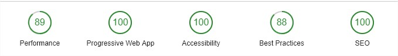

# Angular test

This is a test for show my skills with Angular

## Installation steps

- npm install

- npm start

## Run unit tests

- npm test

## Run e2e tests

- npm run-script e2e

## Build project

- npm run-script build

## Project

This project is based in 3 main views (Login, Home and Profile).

All these views are Page component type, inside these pages there are shared components.

## Login credentials:

Username: **user**

Password: **pass**
  
## Performance test

## Production environment

[Production link](https://creatures.harrinsonmb.me)
